# The AgentShop app

AgentShop is a small online shop for iPhone, built with SwiftUI and
[The Composable Architecture](https://github.com/pointfreeco/swift-composable-architecture). You sign in, a new
account is walked through a short onboarding, and then you browse a catalog of twelve products, fill a cart and
place an order. Everything behind the screens (accounts, catalog, cart, orders) is an in-memory mock, so the app
runs anywhere with no server.

It is deliberately ordinary: the flows every app has, with the validation, errors and edge cases that make them
hard to test. What makes it unusual is that each screen also describes itself to an agent (its `+Agent.swift`
file): what it shows, as one line of `key=value`, and the commands it accepts. That is what lets
[AgentCtl](../../../README.md) drive the app headlessly, through the simulator bridge, or turn the same script into
a UI test. The [README](../README.md) shows the three modes; the [benchmark](../../../docs/benchmarks) compares them.

The screenshots are the real app on an iPhone 17 Pro simulator, each reached by an agent script
(`python3 bench/screenshots.py`).

## Authentication

<p>
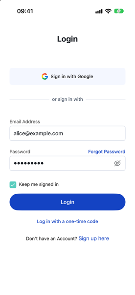
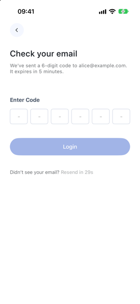
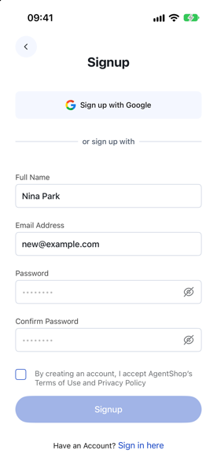
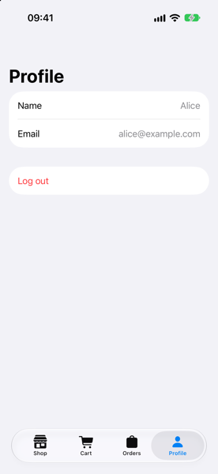
</p>

- **Login** with email and password, "keep me signed in", show/hide password, and Google sign-in. Wrong
  passwords count down to a lockout; an unknown email or a network error shows inline with a retry.
- **One-time code**: send a code to the email, enter six digits, resend after 30 seconds, three attempts.
- **Sign up**: name, email, password twice, accept the terms, then verify the email with a code.
- **Forgot password**: code by email, then a new password.
- **Profile** with the signed-in user, and log out (with a confirmation).

## Onboarding

<p>
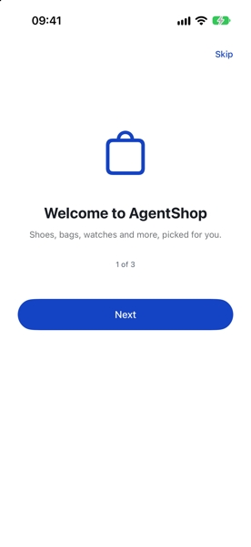
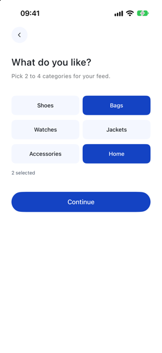
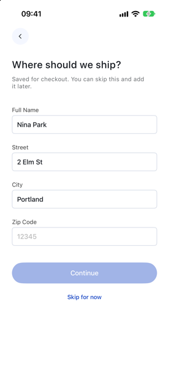
</p>

Shown once, the first time a new account signs in (`nina@example.com`):

- **Welcome**: three pages, with next, back and skip.
- **Interests**: pick two to four categories.
- **Shipping address**: validated (the zip code), or skipped. A saved address fills in checkout later.
- **Notifications**: allow or not now; either finishes onboarding and saves it to the account.

## Shop

<p>
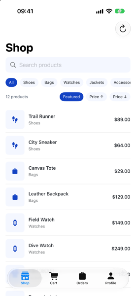
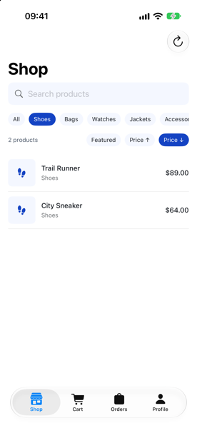
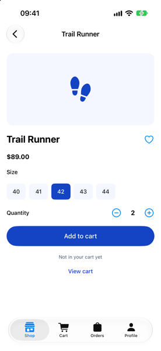
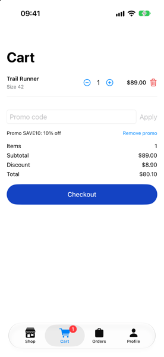
</p>
<p>
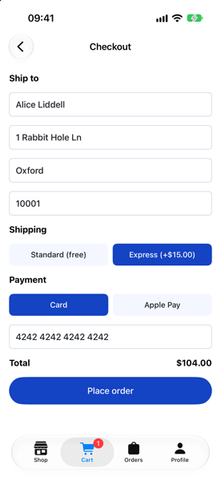
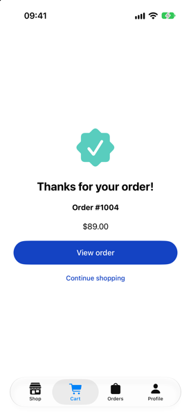
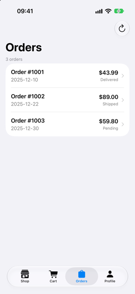
</p>

- **Feed**: twelve products; filter by category, search, sort by price, refresh.
- **Product**: sizes for shoes (40–44) and jackets (S/M/L), quantity, favorite, add to cart. One product is out
  of stock.
- **Cart**: change quantities, remove lines, promo codes (`SAVE10` is 10 % off, `HALF` is 50 %). The tab shows a
  badge with the item count.
- **Checkout**: the saved address prefilled, standard or express shipping, card or Apple Pay. Card
  `4000 0000 0000 0002` is always declined.
- **Order placed**, then the order in **Orders** (pull to refresh).

## Accounts

| Account | Password | |
|---|---|---|
| `alice@example.com` | `Passw0rd!` | onboarded, three orders, a saved address |
| `bob@example.com` | `Hunter22x` | onboarded, no orders, no address |
| `nina@example.com` | `Passw0rd!` | not onboarded yet: signing in starts onboarding |
| `locked@example.com` | any | always locked |

## What an agent sees

Checkout, as the agent reads it after each command (`./appctl run`, headless):

```text
> checkout
  screen=home/cart/checkout name="Alice Liddell" street="1 Rabbit Hole Ln" city=Oxford zip=10001 shipping=standard payment=card total=$29.00 canPlace=false loading=false calls=account.fetchProfile
> card 4242 4242 4242 4242
  screen=home/cart/checkout name="Alice Liddell" street="1 Rabbit Hole Ln" city=Oxford zip=10001 shipping=standard payment=card total=$29.00 canPlace=true loading=false
> place-order
  screen=home/cart/confirmation order=1004 total=$29.00 calls=orders.placeOrder
```

Every command a screen accepts is listed in [`agent-commands.md`](../agent-commands.md).
